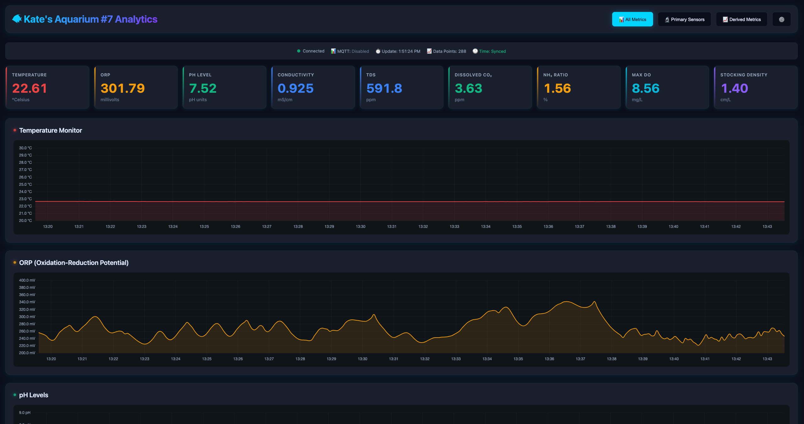

# Fish Tank Controller

> **ESP32-based wireless aquarium controller for comprehensive water quality monitoring and control**

[]()
[]()
[]()
[](LICENSE)

Wireless aquarium controller (freshwater/saltwater) built around the **Sentron POET pH/ORP/EC/Temperature I2C sensor** with web interface, MQTT integration, and Home Assistant support.


*Web interface showing live sensor readings and derived water quality metrics*

---

## Key Features

### Comprehensive Water Quality Monitoring

- **Primary Sensors:** Temperature, pH, ORP (Oxidation-Reduction Potential), EC (Electrical Conductivity)
- **Derived Metrics:** TDS, Dissolved CO2, Toxic Ammonia (NH3), Max Dissolved Oxygen, Stocking Density
- **Real-time Updates:** Auto-refreshing dashboard with 5-second intervals
- **Historical Data:** 24 minutes of history with Chart.js visualization

### Web Interface

- **Responsive Design:** Works on desktop, tablet, and mobile
- **Live Dashboard:** Real-time sensor readings with status indicators
- **Interactive Charts:** Historical data visualization with view toggles
- **Calibration Interface:** Tab-based pH/EC calibration, tank settings, and MQTT configuration
- **Dark/Light Themes:** User preference persists across sessions
- **Data Export:** CSV and JSON export for analysis

### Home Automation Integration

- **MQTT Publishing:** Individual sensor topics + combined JSON payload
- **Home Assistant Discovery:** Automatic entity creation
- **Real-time Status:** Connection monitoring on all pages
- **Configurable:** Broker, auth, publish interval via web UI
- **Derived Metrics:** All calculated metrics published to MQTT

### Easy Setup

- **WiFi Provisioning:** Captive portal for easy WiFi setup
- **mDNS Support:** Access via `http://aquarium.local`
- **Persistent Storage:** Configuration survives reboots (NVS)
- **No Cloud Required:** Works completely offline

### Advanced Features

- **OTA Updates:** Over-the-air firmware updates with rollback protection
- **Sensor Calibration:** pH (1-point/2-point) and EC (cell constant) calibration
- **Tank Configuration:** Shape, volume, water chemistry parameters
- **Fish Stocking Tracker:** Manage fish profiles with automatic density calculation
- **Memory Monitoring:** Built-in heap tracking for stability profiling
- **Failsafe Ready:** Designed for future relay/driver control with safety interlocks

---

## Quick Start

### 1. Hardware Requirements

- **ESP32 board** (ESP32-C6 primary, ESP32-C3 compatible)
- **Sentron POET sensor** (pH/ORP/EC/Temperature I2C)
- **USB cable** for programming
- **WiFi network** (2.4GHz)

### 2. Flash Firmware

```bash
# Clone repository
git clone https://github.com/yourusername/fishtankcontroller.git
cd fishtankcontroller

# Build (defaults to ESP32-C6)
pio run

# Build for ESP32-C3
pio run -e seeed_xiao_esp32c3

# Upload to device
pio run -t upload

# Monitor serial output
pio device monitor
```

### 3. Connect to WiFi

On first boot, device creates AP:

- **SSID:** `AquariumSetup`
- **Password:** `aquarium123`
- Navigate to `http://192.168.4.1` and configure WiFi

### 4. Access Web Interface

- **mDNS:** `http://aquarium.local`
- **Direct IP:** Check serial monitor for assigned IP

---

## Build Targets

| Command | Target Board |
|---------|--------------|
| `pio run` | ESP32-C6 (default) |
| `pio run -e seeed_xiao_esp32c6` | ESP32-C6 (explicit) |
| `pio run -e seeed_xiao_esp32c3` | ESP32-C3 |
| `pio test -e native` | Run unit tests (host) |
| `pio test -e esp32c6_test` | Run embedded tests |

---

## Documentation

### Getting Started

- **[Installation Guide](docs/INSTALLATION.md)** - Flash firmware, WiFi provisioning, first boot
- **[Hardware Setup](docs/HARDWARE.md)** - Wiring, POET sensor, power requirements

### Configuration and Usage

- **[Web UI Guide](docs/WEB_UI.md)** - Dashboard, charts, API endpoints
- **[Calibration Guide](docs/CALIBRATION.md)** - pH and EC sensor calibration procedures
- **[Configuration Guide](docs/CONFIGURATION.md)** - Tank settings, fish profiles, water chemistry
- **[MQTT Integration](docs/MQTT.md)** - Home Assistant setup, broker configuration, topics

### Reference

- **[Calculations Guide](docs/CALCULATIONS.md)** - Derived metrics formulas and methodologies
- **[Testing Guide](docs/TESTING.md)** - Unit tests, embedded tests, memory profiling
- **[Development Guide](docs/DEVELOPMENT.md)** - Build system, architecture, roadmap, contributing
- **[Troubleshooting](docs/TROUBLESHOOTING.md)** - Common issues and solutions

---

## Current Status

### Working Features

**Core Infrastructure:**

- ESP32-C6/C3 support with ESP-IDF 5.5 framework
- WiFi connection with AP provisioning
- POET I2C sensor driver (full protocol)
- mDNS responder and SNTP time sync
- OTA firmware updates with rollback protection

**Monitoring:**

- Real-time sensor readings (temp, ORP, pH, EC)
- Derived metrics (TDS, CO2, NH3, DO, stocking)
- 288-point historical data buffer
- CSV/JSON export via web UI
- Memory usage monitoring

**User Interface:**

- Live dashboard with auto-refresh
- Historical charts with Chart.js
- Calibration interface (pH, EC)
- Tank configuration and fish profiles
- Dark/light theme toggle
- Responsive mobile design

**Integration:**

- MQTT client with auto-reconnection
- Home Assistant MQTT Discovery
- Configurable broker via web UI
- Real-time connection status
- All metrics published to MQTT

### Planned Features

- [ ] WebSocket live updates (currently HTTP polling)
- [ ] Output control (relays/drivers) with failsafes
- [ ] Scheduled automation and rules engine
- [ ] Alert thresholds and notifications
- [ ] Long-term data logging (flash/SD/cloud)
- [ ] Flutter cross-platform app
- [ ] TLS/SSL for secure MQTT

See [Development Guide](docs/DEVELOPMENT.md) for full roadmap.

---

## Sensor Capabilities

### Primary Measurements

| Sensor | Range | Accuracy | Notes |
|--------|-------|----------|-------|
| **Temperature** | 0-100C | +/-0.5C | No calibration required |
| **pH** | 0-14 | +/-0.1 pH | Requires 1-point or 2-point calibration |
| **ORP** | -1000 to +1000 mV | +/-5 mV | Reference electrode dependent |
| **EC** | 0-200 mS/cm | +/-2% | Requires cell constant calibration |

### Derived Metrics

- **TDS (Total Dissolved Solids):** Calculated from EC with configurable conversion factor
- **Dissolved CO2:** Based on pH and KH (carbonate hardness)
- **Toxic Ammonia (NH3):** Temperature and pH dependent calculation
- **Max Dissolved Oxygen:** Temperature-dependent saturation point
- **Stocking Density:** Fish length per liter with color-coded warnings

---

## Home Assistant Integration

**Automatic entity creation with MQTT Discovery:**

### Primary Sensors

- `sensor.aquarium_temperature` - Temperature (C)
- `sensor.aquarium_ph` - pH value
- `sensor.aquarium_orp` - ORP (mV)
- `sensor.aquarium_ec` - Electrical Conductivity (mS/cm)

### Derived Metrics

- `sensor.aquarium_tds` - Total Dissolved Solids (ppm)
- `sensor.aquarium_co2` - Dissolved CO2 (ppm)
- `sensor.aquarium_nh3_fraction_percent` - Toxic Ammonia Fraction (%)
- `sensor.aquarium_nh3_ppm` - Toxic Ammonia Concentration (ppm)
- `sensor.aquarium_max_do` - Max Dissolved Oxygen (mg/L)
- `sensor.aquarium_stocking` - Stocking Density (cm/L)

**Setup:** Configure MQTT broker in web UI, enable HA Discovery, entities appear automatically!

See [MQTT Guide](docs/MQTT.md) for complete setup instructions.

---

## Safety Considerations

This controller is designed to support life-support systems for living organisms:

- Define safe default states for all outputs
- Implement watchdog timers for critical equipment
- Use proper enclosures, fusing, and isolation for mains-powered devices
- Consider galvanic isolation between sensor and equipment
- Test failsafe behavior regularly
- Follow local electrical codes

See [Hardware Guide](docs/HARDWARE.md) for detailed safety information.

---

## Contributing

Contributions welcome! Please read the [Development Guide](docs/DEVELOPMENT.md) first.

**Before submitting PR:**

- Test on actual hardware
- Run tests: `pio test -e native`
- Follow existing code style
- Update documentation
- Include hardware/firmware version in PR description

---

## License

This project is licensed under the **Apache License 2.0**.

**What this means:**

- **Use freely** - Use for personal, educational, or commercial purposes
- **Modify** - Create derivative works and modifications
- **Distribute** - Share and redistribute the software
- **Patent grant** - Explicit patent license from contributors
- **No trademark grant** - Brand/name usage requires permission (see below)

**Requirements:**

- **Attribution** - Include copyright notice and license
- **State changes** - Document modifications you make
- **Include license** - Provide LICENSE and NOTICE files with distributions

**Trademark and Commercial Use:**

- The FishTankController name and branding are protected trademarks
- See [TRADEMARK.md](TRADEMARK.md) for branding guidelines
- See [COMMERCIAL.md](COMMERCIAL.md) for commercial use guidance and partnership opportunities

**Copyright 2026 Scott McLelsie**

See [LICENSE](LICENSE) file for complete terms.

---

## Acknowledgments

- **Sentron** for the POET sensor and protocol documentation
- **Espressif** for ESP-IDF framework
- **Home Assistant Community** for MQTT Discovery standards
- **Chart.js** for excellent charting library

---

## Support

- **Issues:** [GitHub Issues](https://github.com/yourusername/fishtankcontroller/issues)
- **Discussions:** [GitHub Discussions](https://github.com/yourusername/fishtankcontroller/discussions)
- **Documentation:** See [docs/](docs/) folder

---

**Made with care for aquarium enthusiasts**
